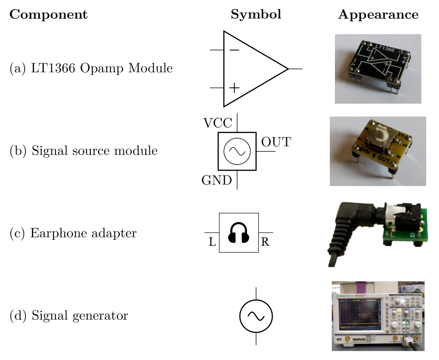
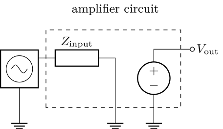
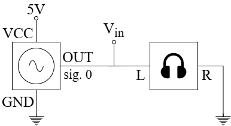
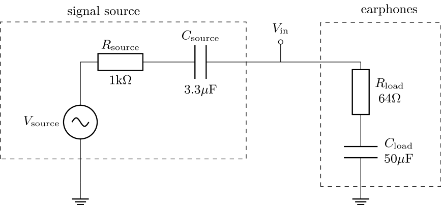
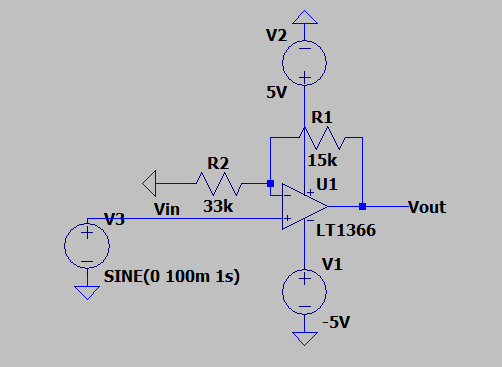
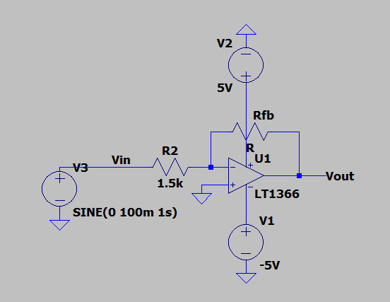
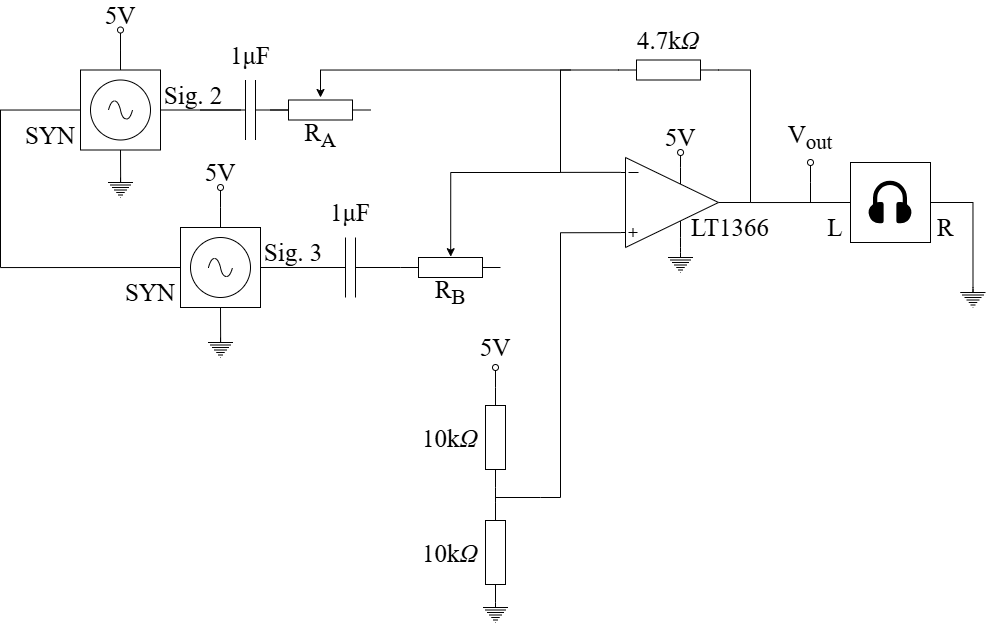

# Analysis and Design of Circuits Lab
# Part 2: Autumn Term weeks 8--10

## Section 1: Biasing and amplification

## Introduction

Opamps are used for amplifying and processing analogue signals.
In this experiment you will build some of the most common opamp circuits.
There are two parts to the experiment and you should allow approximately one lab session for each part, leaving one session for catchup and oral preparation.
				

		
### LT1366 opamp

Opamps are produced by manufacturers to different specification to suit a range of applications.
Since the ideal behaviour of an opamp is a universal concept, these specifications generally define how a particular opamp deviates from the ideal model.
			
You will use the LT1366 opamp module in this experiment (shown in the table above).
The opamp itself is an *integrated circuit* soldered to the bottom of the module.
The module contains some extra components that protect the opamp from damage.
There are two opamps in the LT1366, which have independent inputs and outputs but share the same power supply.
			
The positive power supply to the opamp module should be connected to the V+ pin and the negative supply or ground to V−.
Refer to the diagram printed on the module to connect to the opamp inputs and outputs.
			
The full datasheet for the LT1366 can be found on the [manufacturers website](https://www.analog.com/media/en/technical-documentation/data-sheets/1366fb.pdf) — you will need to refer to it for parts of the experiment.
Refer to the appendix for details about why the LT1366 was selected for this experiment.
			
### Signal source

Opamps usually carry out some sort of signal amplification or processing.
In this experiment you are given a pair of signal source modules (shown in the table above) that can be included on your breadboard to introduce a variety of signals.
			
The module requires a power supply of 5–15V, supplied in the experiment by connections to the positive power rail (V+) and ground (GND).
The output signal is generated on the OUT pin and a SYN pin is used to synchronise the signals from two modules or to provide an oscilloscope trigger.
A rotary switch on the top selects which signal is generated; the options are:			

| Mode | Signal |
| ---- | ------ |
| 0   |	Sine wave |
| 1   |	Noisy sine wave |
| 2   |	Music melody |
| 3   |	Music bass |
| 4   |	Unused |
| 5   |	Unused |
| 6   |	Unused |
| 7   |	Unused |
| 8   |	Melody with whine |
| 9   |	Ground |
			
The SYN pin is used in certain modes to synchronise two signal source modules.
You will be shown when to use it.
Most experiment kits contain one green and one yellow signal source module.
Use the yellow version for all tasks that require just one signal source.
			
## Before the lab

1. Examine the [inverting amplifier](#inverting-amplifier) below. Determine a value of feedback resistor $R_\text{fb}$ to produce a voltage gain of $-1.5\pm5\%$.
2. An idealised amplifier circuit can be represented as an input impedance to ground and a voltage source and is shown here connected to a signal source:

Determine the theoretical input impedance $Z_\text{input}$ of the single supply [inverting amplifier](#single-supply-inverting-amplifier) and [non-inverting amplifier](#single-supply-non-inverting-amplifier).
  Remember that the opamp itself has an (ideally) infinite impedance at the input pins so any finite impedance must originate from resistors connected to ground.
  Use the virtual ground approximation in the case of the inverting amplifier.
  A voltage source such as the 5V power supply can be considered as short circuit to ground.

## Signal source

This experiment uses opamps to process signals generated by signal source modules and amplify them so they can be heard on pairs of earphones.
First, find out what happens if the signal source module is connected directly to the earphones.
The diagram below shows how to make the connection between the two modules.
Note that the earphone adapter has a GND connection that is unused in this experiment; just use L and R. 

			
Use the 5V voltage source in the Orangepip to power the signal source module.
Move the rotary switch on the signal source module to position 0, which generates a sine wave.
Plug the earphones into the socket on the adapter module, power the circuit and listen carefully.
			
- [ ] Test the performance of the signal source module without amplification.
			
Clearly some amplification is needed to make the sound louder.
Measure the signal amplitude from the signal source at $V_\text{in}$ with and without the earphones connected.
Without the earphones the amplitude is reasonably large (500mV amplitude is sufficient to drive the earphones loudly) but the signal source cannot provide enough current and the amplitude drops when the circuit is complete.
			
The next diagram shows an equivalent circuit for what you have built.
The earphones have a predominantly resistive impedance of 64Ω (32Ω per channel, connected in series) and the adapter module contains 50µF of series capacitance to prevent the earphones being damaged by DC current.
The signal source module has an equivalent circuit made of $V_\text{source}$, $R_\text{source}$ and $C_\text{source}$. $R_\text{source}$ and $C_\text{source}$ form the *output impedance* of the signal source.

When the earphone is connected, the current flowing in the earphones results in a voltage drop across $V_\text{source}$ and $C_\text{source}$.
This results in the reduction that you can measure at $V_\text{in}$ and the quiet sound.
Put another way, most of the power produced by the signal source is dissipated in its own internal resistance and not the earphone.
			
Confirm that the change in $V_\text{in}$ when the earphones are connected is consistent with the values of $R_\text{source}$ and $R_\text{load}$, assuming the frequency is high and the impedance of both capacitors in negligible.
			
- [ ] Test the performance of the signal source module without amplification.	Confirm the effect of the earphone load on the amplitude of $V_\text{in}$.

## Powering the opamp with dual +/-5V rails

The opamp needs a power supply connected to its V+ and V- pins, and its output can only swing between those two voltages. In the single-supply circuits the negative rail was 0V, so the output could not go below ground and the negative half of the signal was lost. Providing a *negative* supply as well removes this limitation.

The **bench power supply** (the "power bench") on your lab bench can provide this. It has more than one independent, adjustable output, so you can set up two rails that share a common ground:

- Set one output to **+5V** -- this is the positive rail, connected to the opamp's V+ pin.
- Set a second output to **-5V** -- this is the negative rail, connected to the opamp's V- pin. Many bench supplies have a *tracking* (dual) mode that produces +5V and -5V together from a single control.
- The **ground (0V)** terminal shared by the two outputs is the circuit ground, to which the signal source and the amplifier's ground connections are returned.

With a symmetric +/-5V supply the opamp output can swing both above and below ground, so the amplifier circuits below no longer need the 2.5V biasing network or the DC-blocking capacitors used in the single-supply versions -- they can be built in their simplest form.

## Inverting Amplifier

An amplifier can help make the signal louder in three ways:
1. It adds gain so that the output voltage amplitude is larger than the input amplitude.
2. It has a higher input or load impedance than the earphones, so there is a smaller reduction in $V_\text{in}$ when it is connected.
3. It has a lower output or source impedance than the signal source module, so it can supply the current required by the earphones without a reduction in amplitude.

With the dual +/-5V rails in place, a simple inverting amplifier works directly: the negative rail lets the output follow the negative half of the signal, so there is no clipping and no need for a bias voltage or a DC-blocking capacitor.

The signal $V_\text{in}$ is applied through the input resistor $R_2$ to the inverting input, and the feedback resistor $R_1$ connects the output back to the same node; the non-inverting input is connected directly to ground. The opamp holds the inverting input at a virtual ground (0V), so the gain is set by the ratio of the two resistors:

$$ \frac{V_\text{out}}{V_\text{in}} = -\frac{R_1}{R_2} $$

With $R_1 = 15\text{k}\Omega$ and $R_2 = 33\text{k}\Omega$ the gain is about $-0.45$; change $R_1$ (or $R_2$) to set a different gain.

- [ ] Build the dual-rail inverting amplifier, connect oscilloscope CH1 to $V_\text{in}$ and CH2 to $V_\text{out}$, and confirm that the whole waveform is amplified and inverted without the clipping seen with a single supply.

## Non-inverting Amplifier

Build a non-inverting amplifier using the same dual +/-5V supply:

Here the signal is applied to the non-inverting input through $R_2$, the feedback resistor $R_\text{fb}$ connects the output back to the inverting input, and $R$ connects the inverting input to ground. Because the opamp forces its two inputs to the same voltage, the gain is:

$$ \frac{V_\text{out}}{V_\text{in}} = 1 + \frac{R_\text{fb}}{R} $$

Unlike the single-supply version, no potential divider is needed to bias the input and no coupling capacitors are required, because the negative rail lets the output swing symmetrically about ground. $R_2$ sets the input impedance seen by the source but does not affect the gain, since (ideally) no current flows into the non-inverting input.

- [ ] Build and test the dual-rail non-inverting amplifier, and measure its gain.

## Challenge: Audio Mixer

Modes 2 and 3 of the signal source play the left and right hand parts of a piece of piano music.
Listen to them by using your amplifier and changing the mode switch.
The inverting amplifier can be extended with additional inputs to sum the two parts together, as shown below.

				
Build a summing amplifier with two signal sources, one in mode 2 and the other in mode 3.
Note the wire making the SYN connection between the two source modules, which is used to synchronise the two parts of the music.
				
Potentiometers $R_\text A$ and $R_\text B$ set the gain independently for each input.
Choose the values so that input A (mode 2) has a voltage gain of $-2$ and input B (mode 3) has a voltage gain of $-2$.

