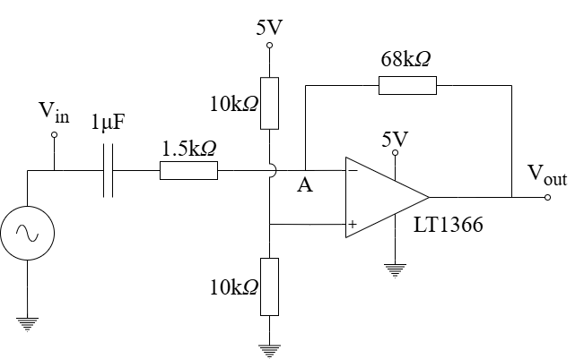
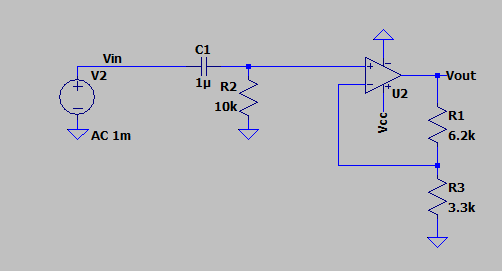
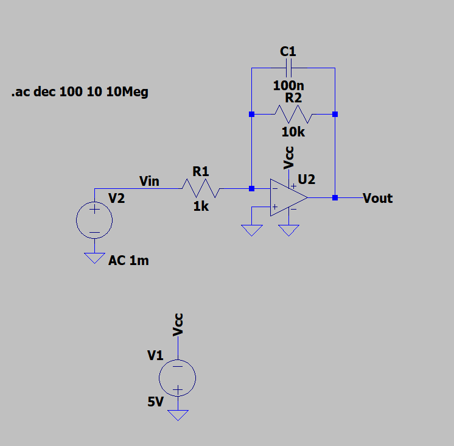

# Analysis and Design of Circuits Lab
# Part 2: Autumn Term weeks 8–10

## Section 2: Bandwidth and Filtering
	
Opamp circuits have frequency-dependent transfer functions just like passive networks containing capacitors and/or inductors.
In this section you will measure the built-in bandwidth limitation of the LT1366 opamp and design a circuit with a custom transfer function.

## Before the lab
1. Look up the datasheet for the LT1366 and find out the *Gain-bandwidth product* for the opamp.
   Also locate the plot for gain versus frequency. How does the gain-bandwidth product relate to the gain transfer characteristic?
2. Signal source mode 8 generates a melody with an annoying whine.
   Use the [Analog Devices Filter Wizard](http://www.analog.com/designtools/en/filterwizard/) to design a low-pass active filter that will block out the unwanted signal.
   Observe the following specifications:
   1. The notes of the tune are in the range 200Hz–2KHz and must lie within the passband
	 2. The unwanted signal is at 8kHZ must lie within the -40dB stopband
	 3. The filter must use no more than two opamp stages (4th order)
	 4. The filter must use 5V and 0V power supplies

The tool shows the *order* of the filter and the number of stages; i.e. the number of opamps required.
The slider under 'Filter Response' allows you to try different circuit types.
You can view the generated circuit in the 'Components' tab.
The generated component values are precise and may not match the values available in the lab component drawers.
Enable the 'I want to choose' option for components and you will see a slider that allows you to trade off between larger capacitors and larger resistors.
You can adjust the slider separately for each stage (opamp) in the design.
Use the slider so that capacitors match available values (e.g. 100nF and 1μF).
Then achieve the required resistances using parallel and series combinations, and allowing a ±10% tolerance.

## Gain bandwidth product
Opamps have built-in low-pass filtering to help ensure that circuits remain stable — without it, high frequency oscillation would occur.
The frequency at which the opamp *open loop* gain drops to unity (0dB) is known as the *gain-bandwidth product* (GBP) and it is usually illustrated in a graph in the opamp datasheet.
Remember that open loop gain is the gain of the opamp with no negative feedback, which is ideally infinite.
The gain of an opamp in a circuit with negative feedback cannot be greater than the open loop gain.

			
The circuit above has a relatively high gain for a single-opamp amplifier.
Use the oscilloscope signal generator (AWG) as an input instead of the signal source module, and set it up with a sine wave with 50mV amplitude and 0V DC offset.
			
Plot a graph of the gain and phase transfer functions of the amplifier by observing the input and output waveforms on the oscilloscope at a number of frequency points between 100Hz and 100kHz.
You will observe a low-pass transfer function with a single corner frequency and a first order roll-off.
			
- [ ] Characterise the gain and phase transfer characteristics of the amplifier. Extrapolate the transfer function at high frequency to confirm that the gain drops to unity (0dB) when frequency equals the gain-bandwidth product of the opamp.

## Challenge: Active Filters

Opamps can be used to build *active filters* -- filters whose passband gain and frequency response are both set by the circuit around the opamp.
Compared with filters that use only passive components, active filters can provide gain as well as filtering, present a low output impedance to whatever follows them, and avoid inductors (which are bulky and have significant parasitics).
Adding a reactive component to one of the resistive paths that sets the gain makes that gain frequency-dependent, turning the amplifier into a filter.

You will build and characterise the two first-order active filters below -- one high-pass and one low-pass. Both run from a single Vcc supply.

### Active high-pass filter

This is a non-inverting amplifier with an AC-coupled input.
The signal passes through the series capacitor $C_1$ into $R_2$, which returns to ground; together they form a passive high-pass at the input that blocks DC and very low frequencies before the amplifier.
The opamp is then wired as a non-inverting amplifier, so the feedback network $R_1$ (from the output) and $R_3$ (to ground) sets a passband gain of

$$ \frac{V_\text{out}}{V_\text{in}} = 1 + \frac{R_1}{R_3} = 1 + \frac{6.2\text{k}}{3.3\text{k}} \approx 2.9 \quad (\approx 9.2\text{ dB}). $$

The high-pass corner is set by the input network:

$$ f_c = \frac{1}{2\pi R_2 C_1} = \frac{1}{2\pi (10\text{k})(1\mu\text{F})} \approx 16\text{ Hz}. $$

Below about 16 Hz the gain falls off at $+20$ dB/decade with the phase leading towards $+90°$ (a first-order high-pass), and above it the response is flat at the passband gain of $\approx 2.9$ until the opamp's own gain-bandwidth limit eventually rolls it off at high frequency.

### Active low-pass filter

This is an inverting amplifier with a capacitor $C_1$ placed in parallel with the feedback resistor $R_2$.
At low frequency the capacitor is effectively open, so the circuit behaves as a plain inverting amplifier with

$$ \frac{V_\text{out}}{V_\text{in}} = -\frac{R_2}{R_1} = -\frac{10\text{k}}{1\text{k}} = -10 \quad (20\text{ dB}). $$

As the frequency rises the impedance of $C_1$ falls and progressively shorts out $R_2$, so the feedback impedance -- and with it the gain -- drops. The corner is where the reactance of $C_1$ equals $R_2$:

$$ f_c = \frac{1}{2\pi R_2 C_1} = \frac{1}{2\pi (10\text{k})(100\text{nF})} \approx 159\text{ Hz}. $$

Above $f_c$ the magnitude rolls off at $-20$ dB/decade (a first-order low-pass) and the phase moves from $180°$ (the inversion) towards $90°$.

### Measuring the transfer function

Measure the transfer function $T(f) = V_\text{out}/V_\text{in}$ of each filter as a Bode plot -- its magnitude and phase against frequency:

1. Power the opamp from the single Vcc supply. Drive the input with the oscilloscope's signal generator (AWG) set to a sine of small, fixed amplitude (about 50 mV) so the output stays within the rails and does not clip. Because the circuits run from a single supply, add a DC offset (about $+1$ V, or Vcc/2) so the signal stays above 0 V, and set the oscilloscope channels to AC coupling when reading the amplitudes.
2. Connect $V_\text{in}$ to CH1 and $V_\text{out}$ to CH2, both referenced to the circuit ground.
3. Sweep the frequency in logarithmically-spaced steps (about 5--10 points per decade) from 10 Hz to 100 kHz.
4. At each frequency record the amplitudes of $V_\text{in}$ and $V_\text{out}$, compute $|T| = |V_\text{out}|/|V_\text{in}|$ and convert it to decibels with $20\log_{10}|T|$.
5. Read the phase from the time shift $\Delta t$ between the zero-crossings of the two waveforms, $\arg(T) = 360\,f\,\Delta t$ (an output that lags the input is a negative phase; remember the low-pass also inverts, adding $180°$).
6. Take extra, closely-spaced points around each corner frequency ($\approx 16$ Hz for the high-pass, $\approx 159$ Hz for the low-pass) so the knee is captured accurately, and plot each point as you go.
7. Plot $|T|$ in dB and $\arg(T)$ in degrees against frequency on a logarithmic axis.

- [ ] Measure and plot the Bode plot (magnitude and phase) of the active high-pass filter, and confirm its passband gain and corner frequency against the values above.

- [ ] Measure and plot the Bode plot of the active low-pass filter, and confirm its passband gain and corner frequency against the values above.

For each filter, comment on any differences between the measured and predicted responses -- in particular, note where the opamp's finite gain-bandwidth product limits the gain at high frequency.
