# Analysis and Design of Circuits Lab

# Part 1: Autumn Term weeks 4--6

## Section 2: Reactive Components

Ideal capacitors and inductors can be analysed by giving them an reactance $X$, which depends on the value of the component and the frequency of the AC voltage and current.
The unit of reactance is Ohms, but it is an imaginary number.
For example, a 1mH inductor has an reactance of $X=j\omega L=6.3j\Omega$ when the frequency is 1kHz.
A 1μF capacitor has a reactance of $X=1/j\omega C=-159j\Omega$ when the frequency is 1kHz.
Using imaginary impedance makes it possible to analyse circuits containing capacitors and inductors without using differential equations.

However, real-world components are never purely reactive and they are better represented as a complex impedance $Z=X+R$.
Depending on the application, the non-ideal impedance may be important and it can be characterised using the same test circuit as in [Section 1](https://github.com/edstott/EEE1labs/blob/main/ADC/Part1/Section1.md).

[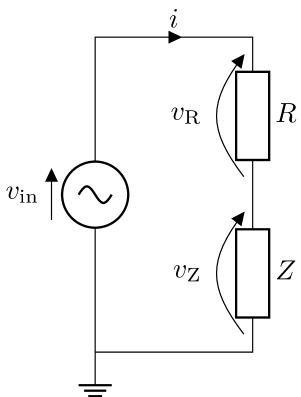](graphics/Zdiv.png)

The oscilloscope measures every voltage with respect to a single **common ground**: the ground (−) terminals of all of its channels are joined together inside the instrument and tied to mains earth through the probe leads.
Whatever node you clip a ground lead to is forced to 0V.
This is exactly why the test circuit is built as a potential divider with one end of $Z$ connected to ground — it lets you measure $v_\text{Z}$ directly, with a channel's + lead on the mid-point and its − lead on the grounded end.

The voltage across the resistor, $v_\text{R}$, cannot be measured in the same direct way, because *neither* end of $R$ sits at ground.
If you try to read $v_\text{R}$ directly — clipping a channel's + lead above $R$ and its ground lead just below $R$, at the mid-point — that earthed ground lead drags the mid-point down to 0V and short-circuits $Z$.
The measurement is meaningless and the circuit no longer behaves as a divider.
Both channel grounds must therefore stay on the true common ground:

<table>
<tr>
<td align="center">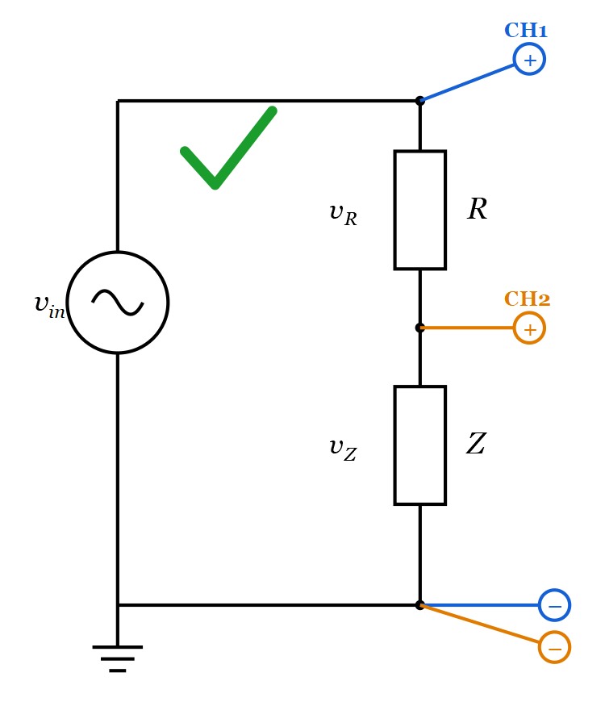 <b>Correct:</b> both ground leads on the common ground. <i>v</i>R is recovered with the math channel.</td>
</tr>
<tr>
<td align="center">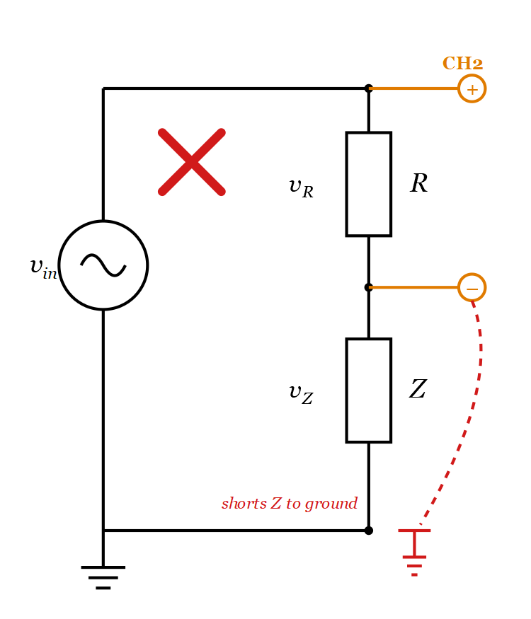 <b>Incorrect:</b> the ground lead placed below <i>R</i> shorts <i>Z</i> to ground.</td>
</tr>
</table>

The calculation you applied earlier still works if the variables are complex:

$$ Z=R\frac{V_\text{Z}}{V_\text{R}} $$

Considering just the magnitude of the impedance gives:

$$ |Z|=R\frac{|V_\text{Z}|}{|V_\text{R}|}=R\frac{v_\text{Z}}{v_\text{R}} $$

We're using a notation where $V$ is a complex voltage, a phasor, while $v$ is a real voltage that has a magnitude but no argument.
The component $Z$ is drawn as a resistor, but the relationship is true of any passive component with a complex impedance $Z$.

### The math channel

Because $v_\text{R}$ cannot be probed directly, it is recovered using the oscilloscope's **math channel**.
Both channels are referenced to the common ground: CHA measures $v_\text{in}$ at the top of the divider and CHB measures $v_\text{Z}$ at the mid-point, each relative to ground.
The math channel then subtracts one from the other, sample by sample, to reconstruct the voltage across $R$:

$$ v_\text{R} = v_\text{in} - v_\text{Z} = \text{CHA} - \text{CHB} $$

This gives $v_\text{R}$ even though $R$ is never connected to ground.
Because the math channel is the *difference* of two sampled waveforms, its quality depends on both inputs being well-resolved: if either channel is noisy or poorly scaled, the subtraction amplifies that error and the reconstructed $v_\text{R}$ becomes unreliable.
The main tool you have to control this is the test resistance $R$, and the two captures below show measurements that are too inaccurate to use and how changing $R$ fixes them:

*CHB is small and fuzzy, and the vertical sensitivity is at its limit — decrease $R$.* [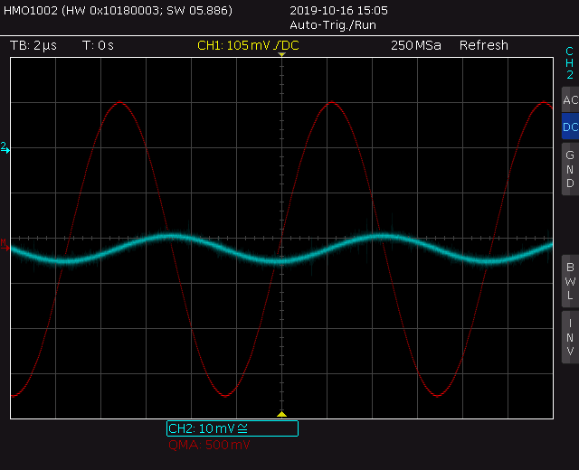](graphics/PN-noisy.png)

*The math channel is blocky (quantised) and it can't be accurately measured — increase $R$.* [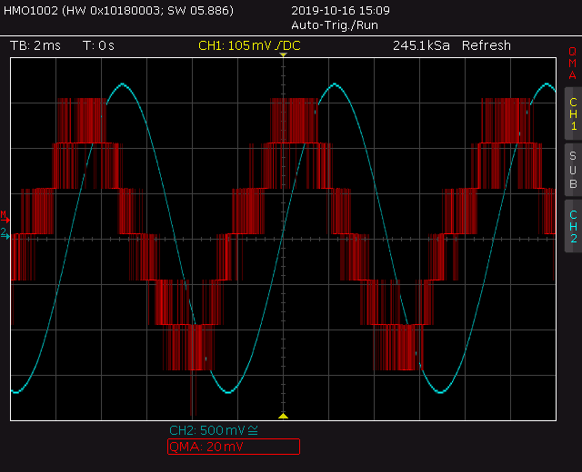](graphics/PN-mathnoise.png)

### Before the lab

The reactance of an ideal capacitor or inductor sets how its impedance changes with frequency: for an ideal inductor $|Z_L|=2\pi f L$ *rises* with frequency, and for an ideal capacitor $|Z_C|=1/(2\pi f C)$ *falls* with frequency.
On logarithmic axes each is a straight line — sloping up for the inductor and down for the capacitor.

Real components are never purely reactive.
Every physical inductor and capacitor also carries a small **series resistance** that comes from the ohmic conductors it is built from — the coil of wire in an inductor, and the leads, plates and dielectric losses in a capacitor (its *equivalent series resistance*, ESR).
The simplest useful model of a real component places this resistance in series with the ideal reactance:

[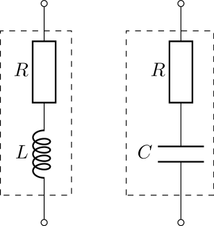](graphics/LCeq.png)

**Why this model is used.**
The series-resistance model is popular because it is the simplest description that still captures how a real component actually behaves over the frequency range of this experiment (1Hz–40kHz):

- The series resistance is the *dominant* parasitic across this range. Other parasitics — an inductor's inter-winding capacitance, or a capacitor's lead inductance — only become important near self-resonance, which lies well above the frequencies you will measure, so they can be ignored here.
- Because the resistance is in series, it simply adds to the reactance: $Z = R + jX$. The model therefore needs only *one* extra number, $R$, to describe the component's departure from ideal, which makes it easy both to analyse and to fit to measured data.
- It reproduces the two features you actually observe in measurement: a flat resistive floor where the reactance becomes small, and a straight reactive line where the reactance dominates.

### Characterising an inductor

**Inductor.**
With the series resistance the impedance is $Z_L = j\omega L + R$, so its magnitude is $|Z_L| = \sqrt{R^2 + (2\pi f L)^2}$.
At low frequency $2\pi f L \ll R$, so the magnitude flattens to the resistive floor $R$; at high frequency $2\pi f L \gg R$, so the magnitude climbs along the ideal $2\pi f L$ line.
The two regions meet at the corner frequency $f = R/(2\pi L)$:

[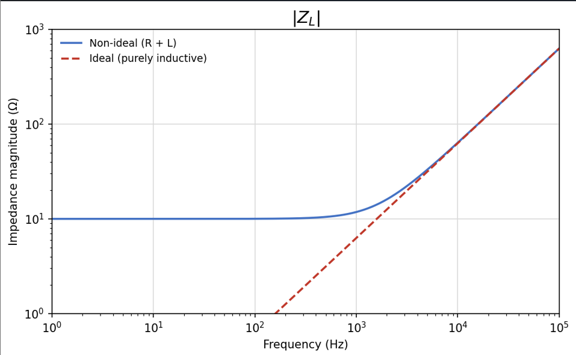](graphics/inductor_Z_ideal_nonideal.png)

The dashed line is the ideal inductor ($|Z_L| = 2\pi f L$, a straight line of gradient $+1$); the solid line is the non-ideal model.
Note how the two are indistinguishable at high frequency and separate only once the reactance falls below $R$.

Inductors tend to be less faithful to an ideal component than capacitors: at low frequency the parasitic resistance of the coil of wire becomes significant compared with the reactance, and at high frequency the capacitance between the tightly-packed turns of wire can cause further non-ideal behaviour.
This makes careful measurement important.
Measure the impedance with the potential-divider method and the math channel from earlier, choosing the test resistance $R$ so that both $v_\text{Z}$ and $v_\text{R}$ are easy to read (the same $R$-selection rules given for the capacitor below apply here).
Update your graph with every data point as you take it, so you can see whether the points lie on a trend: if three points within a decade ( $\times10$ in frequency) fall on a straight line you can assume the characteristic is straight between them; if not, fill in extra measurements to find the shape of the curve.
On logarithmic axes a small vertical deviation represents a large change, so don't dismiss anomalies as experimental error — check them.

- [ ] Measure the impedance of **two different inductors** (for example 1mH and 100mH) at logarithmically-spaced frequencies between 1Hz and 40kHz, plot $|Z_L|$ against $f$ on logarithmic axes for each, and find the extent of frequencies over which each obeys the ideal equation $|Z_L|=2\pi f L$.

Discuss your results: identify the inductive (straight, gradient $+1$) region and the low-frequency resistive floor of each inductor; read $L$ from the gradient of the reactive region and $R$ from the height of the floor; and compare the two components — which stays closer to the ideal line over the measured range, and why?

Plot your experimental data on the same axes as your prediction from the preparation exercise, and tune the values of $L$ and $R$ to make the model fit your real inductor as closely as possible. How well does the model fit?

- [ ] Fit your model to the experimental data and create a graph that compares them.

### Characterising a capacitor

**Capacitor.**
The same reasoning applies with high and low frequency swapped.
The non-ideal impedance is $Z_C = 1/(j\omega C) + R$, so $|Z_C| = \sqrt{R^2 + (1/2\pi f C)^2}$.
Now the reactance is large at low frequency, so the magnitude follows the ideal $1/(2\pi f C)$ line there; at high frequency the reactance drops below the ESR and the magnitude flattens to the resistive floor $R$:

[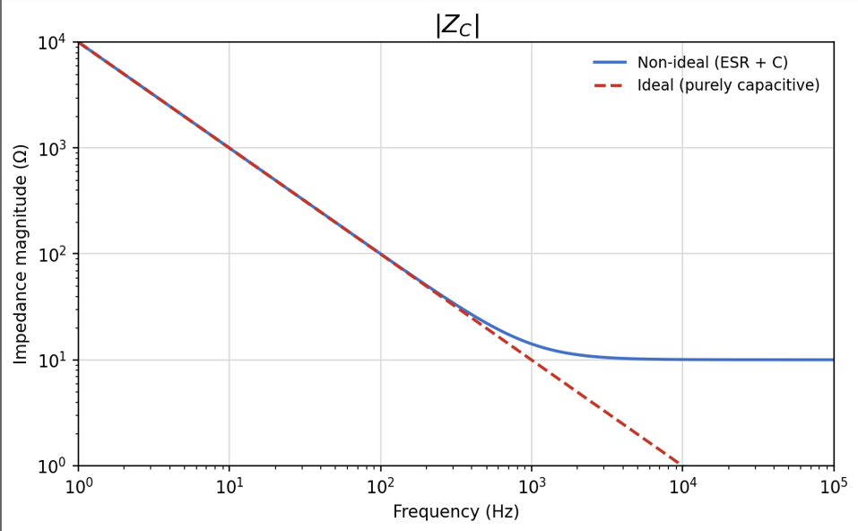](graphics/capacitor_Z_ideal_nonideal.png)

Again the dashed line is the ideal capacitor (a straight line of gradient $-1$) and the solid line the non-ideal model, which peels away from the ideal only once the reactance falls below the ESR.
Capacitors are usually closer to ideal than inductors across this range because their series resistance is very small.

**Making the measurement.**
Connect the capacitor as $Z$ in the potential divider and, at each frequency, record $v_\text{Z}$ and $v_\text{R}$ and compute the impedance from $|Z| = R\,v_\text{Z}/v_\text{R}$ with a spreadsheet formula. Record your data like this:

| $f$ | $R$ | $v\_\text{Z}$ | $v\_\text{R}$ | $\|Z\|$ |
| --- | --- | ------------- | ------------- | ------- |
| 1   | …   | …             | …             | …       |
| 3.2 |     |               |               |         |
| 10  |     |               |               |         |
| 32  |     |               |               |         |
| …   |     |               |               |         |

You must choose a value of the test resistance $R$, and it affects the accuracy of the measurement — start with 1kΩ and change it as you go according to these rules:

- If $v_\text{Z}$ (CHB) is less than 5mV RMS, decrease $R$ by a factor of 100 (down to a minimum of 10Ω).
- If $v_\text{R}$ (math channel) is smaller than 1 vertical division peak-to-peak, increase $R$ by a factor of 100.

These rules keep the magnitudes of $R$ and $Z$ close, which is where the measurement is most accurate; if they differ by many decimal places the reading becomes unreliable. If you are unsure, calculate the theoretical $|Z|$ and choose $R$ to be similar. The two captures of inaccurate math-channel measurements shown earlier tell you which way to change $R$ when a reading looks poor. Take measurements at the same logarithmically-spaced frequencies you used in the preparation task, and plot each point as you go.

- [ ] Measure the impedance of **two different capacitors** (for example 1μF and 33nF) between 1Hz and 40kHz, plot $|Z_C|$ against $f$ on logarithmic axes for each, and confirm that they obey $|Z_C|=1/(2\pi f C)$ (a straight line of gradient $-1$).

Discuss your results: identify the capacitive (straight, gradient $-1$) region for each capacitor; check whether the ESR floor is reached within the measurable range; extract $C$ from the reactive region; and compare the two capacitors with each other, and with the inductors you measured earlier.

### Measuring an unknown inductor

There is a box of unmarked inductors. Pick out one unknown inductor and find its inductance.

Because $|Z_L|=2\pi f L$ is a straight line through the origin in the linear region, only a few measurements are needed to determine $L$ accurately.
As long as you stay in the linear region — above the low frequencies where the parasitic series resistance dominates, and below self-resonance — every measurement lies on the same straight line, so a handful of points is enough to fix its gradient.
Take impedance measurements at a small number of frequencies in this region and find $L$ from the gradient of $|Z_L|$ against $f$, or equivalently from $L=|Z_L|/(2\pi f)$ at each point.
Additional measurements only confirm the value rather than refining it.
Verify your result using the LCR bridge (ask for help with this piece of equipment), then return the inductor so that others can use it.

- [ ] Measure the value of one unknown inductor.

### First-order RL and RC filters

The impedance of an inductor or a capacitor changes with frequency, so combining one with a resistor produces a circuit whose behaviour depends on frequency.
A circuit that changes a signal according to frequency is called a *filter*, and it is described by its *transfer function* $T(f)=V_\text{out}(f)/V_\text{in}$ — the ratio of output to input, which has both a magnitude and a phase.
Each first-order filter has a *corner frequency* $f_c$ that marks the transition between the frequencies it passes and those it attenuates.

You will characterise the same **RL filter** in two configurations. Both use $R_1 = 1\text{k}\Omega$ and $L_1 = 1\text{mH}$; the only difference is which component the output is taken across.

**Low-pass (output across the resistor).**
The inductor is in series and the output is taken across $R_1$.
At low frequency the inductor's impedance is small, so almost all of the input appears across $R_1$ and the output follows the input; as frequency rises the inductor's impedance grows and takes a larger share of the voltage, so the output falls.
The transfer function is $T = R_1/(R_1 + j\omega L_1)$, with corner frequency $f_c = R_1/(2\pi L_1)$.

[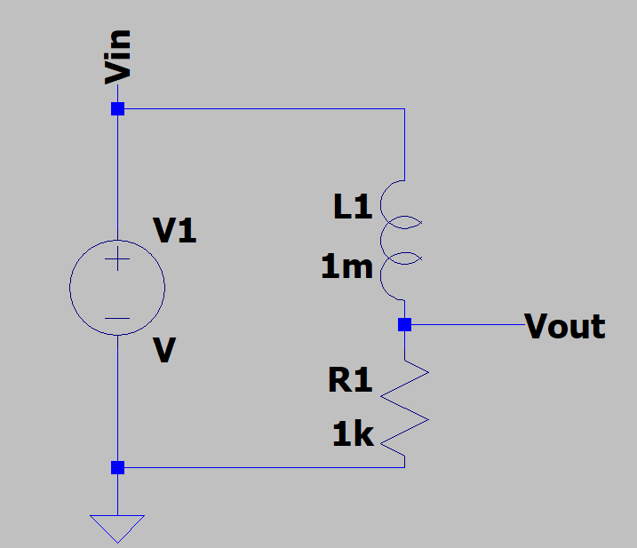](graphics/rl_lowpass.png)

**High-pass (output across the inductor).**
Now the resistor is in series and the output is taken across $L_1$.
At low frequency the inductor drops almost no voltage so the output is small; as frequency rises its impedance grows and the output increases.
The transfer function is $T = j\omega L_1/(R_1 + j\omega L_1)$, with the same corner frequency $f_c = R_1/(2\pi L_1)$.

[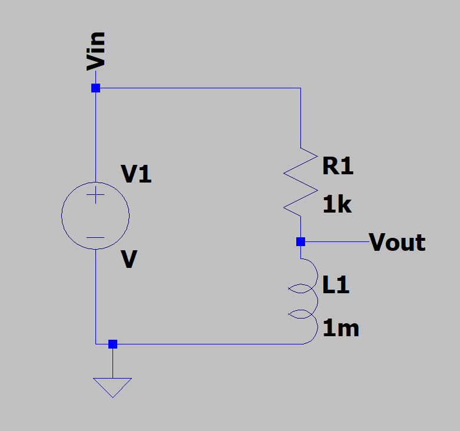](graphics/rl_highpass.png)

With $R_1 = 1\text{k}\Omega$ and $L_1 = 1\text{mH}$ the corner frequency is $f_c = R_1/(2\pi L_1) \approx 159\text{kHz}$, which lies well above the top of the measurement range, so within 10Hz–40kHz you will capture only the very start of the transition — take your highest-frequency points as high as the equipment allows.

**Measuring the Bode plot.**
A *Bode plot* shows both the magnitude and the phase of the transfer function against frequency. Measure it as follows:

1. Drive the input with the signal generator set to a sine wave of fixed amplitude (for example 1V peak). Connect $V_\text{in}$ to oscilloscope CHA and $V_\text{out}$ to CHB, both referenced to the common ground.
2. Step the frequency through logarithmically-spaced points (about 5–10 per decade) from 10Hz to 40kHz.
3. At each frequency read the amplitudes of $V_\text{in}$ and $V_\text{out}$ and calculate the magnitude $|T| = |V_\text{out}|/|V_\text{in}|$, converting to decibels with $20\log_{10}|T|$. Keep the generator amplitude constant as you change frequency.
4. Measure the phase with the oscilloscope cursors: read the time shift $\Delta t$ between the zero-crossings of $V_\text{in}$ and $V_\text{out}$ and convert it with $\arg(T) = 360\,f\,\Delta t$ (an output that lags the input is a negative phase).
5. Plot $|T|$ in dB against $f$, and $\arg(T)$ in degrees against $f$, both on a logarithmic frequency axis — this pair of graphs is the Bode plot.

- [ ] Measure and plot the Bode plot (magnitude and phase) of the RL filter as a **low-pass** (output across $R_1$).

- [ ] Rewire the circuit and measure the Bode plot of the same RL filter as a **high-pass** (output across $L_1$).

**Recreate the responses with a capacitor.**
The same two responses can be built from a resistor and a capacitor.
Because a capacitor's impedance *falls* with frequency — the opposite of an inductor — the roles of the components are swapped: an RC filter is a **low-pass** when the output is taken across the *capacitor*, and a **high-pass** when the output is taken across the *resistor*.

- [ ] Design an RC low-pass and an RC high-pass with the **same corner frequency** as your RL filter — choose $R$ and $C$ so that $1/(2\pi RC) = R_1/(2\pi L_1)$. Build them, measure their Bode plots with the same method, and overlay each on the matching RL response to confirm that the two filters have the same transfer function.

### Filter with a gain floor

Sometimes we want a filter whose gain is fixed at one value at low frequency and settles to a different, non-zero *floor* at high frequency, rather than continuing all the way to unity or to zero.
The circuit below achieves this using an inductor:

[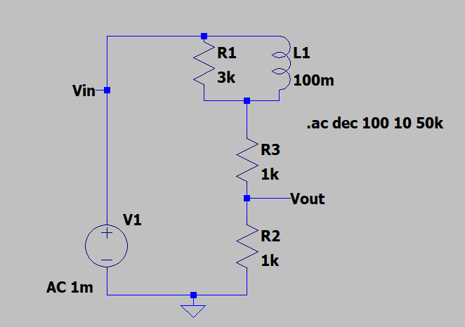](graphics/gain_floor_L.png)

The upper arm is the inductor $L_1$ in parallel with $R_1$, followed by $R_3$ in series; the output is taken across $R_2$ at the bottom of the divider.
At low frequency the inductor behaves as a short circuit and removes $R_1$ from the upper arm, so the gain is set by $R_3$ and $R_2$ alone: $T = R_2/(R_3+R_2) = 1\text{k}/2\text{k} = 0.5$.
At high frequency the inductor behaves as an open circuit, so the full $R_1$ appears in the upper arm and the gain settles to its floor: $T = R_2/(R_1+R_3+R_2) = 1\text{k}/5\text{k} = 0.2$.
Between these limits the response makes a first-order transition from the low-frequency gain of 0.5 down to the high-frequency floor of 0.2, with the transition near $f = R_1/(2\pi L_1) \approx 4.8\text{kHz}$.

- [ ] Derive the transfer function of the circuit and confirm its low-frequency gain (0.5), its high-frequency gain floor (0.2) and its corner frequency.

- [ ] Measure the transfer function with the signal generator driving the input, recording both the magnitude and the phase between 10Hz and 40kHz, and plot them as a Bode plot. Compare with your prediction.

### Challenge: recreate the gain floor with resistors and a capacitor

The inductor in the gain-floor circuit above can be replaced by a capacitor to obtain a filter with an identical transfer function.

- [ ] Design and build a filter that uses only resistors and a **capacitor** and has the **same transfer function** as the inductor gain-floor circuit above: a low-frequency gain of 0.5, a high-frequency gain floor of 0.2, and the same corner frequency.
Measure its magnitude and phase response between 10Hz and 40kHz and overlay it on the response of the inductor circuit to confirm that the two match.

*Hint:* a capacitor's impedance falls with frequency — the opposite of an inductor — so to reproduce the same low-pass shelf the capacitor must be placed in a different arm of the divider from where the inductor sat. Work out where it has to go so that the divider ratio changes from 0.5 at low frequency to 0.2 at high frequency.
