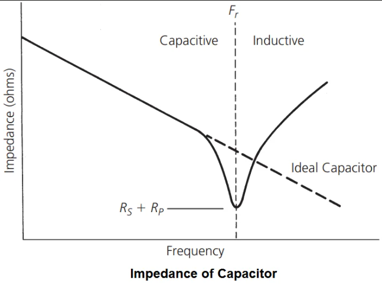
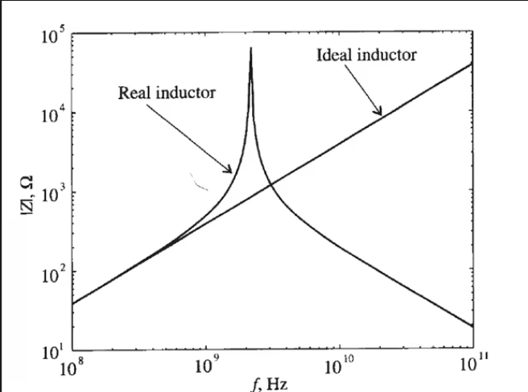
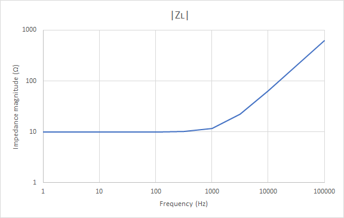
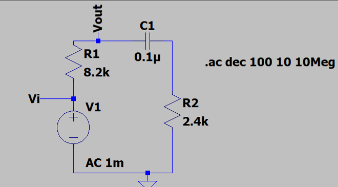
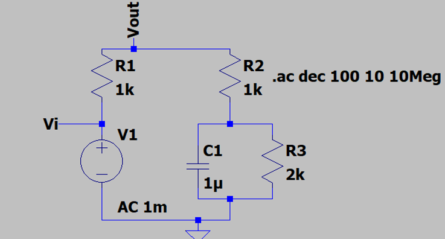

# Analysis and Design of Circuits Lab

# Part 1: Autumn Term weeks 4--6

## Section 2: Reactive Components

Ideal capacitors and inductors can be analysed by giving them an reactance $X$, which depends on the value of the component and the frequency of the AC voltage and current.
The unit of reactance is Ohms, but it is an imaginary number.
For example, a 1mH inductor has an reactance of $X=j\omega L=6.3j\Omega$ when the frequency is 1kHz.
A 1μF capacitor has a reactance of $X=1/j\omega C=-159j\Omega$ when the frequency is 1kHz.
Using imaginary impedance makes it possible to analyse circuits containing capacitors and inductors without using differential equations.

However, real-world components are never purely reactive and they are better represented as a complex impedance $Z=X+R$.
Depending on the application, the non-ideal impedance may be important and it can be characterised using the same test circuit as in [Section 1](https://github.com/edstott/EEE1labs/blob/main/ADC/Part1/Section1.md).

The calculation you applied earlier still works if the variables are complex:

$$ Z=R\frac{V_\text{Z}}{V_\text{R}} $$

Considering just the magnitude of the impedance gives:

$$ |Z|=R\frac{|V_\text{Z}|}{|V_\text{R}|}=R\frac{v_\text{Z}}{v_\text{R}} $$

We're using a notation where $V$ is a complex voltage, a phasor, while $v$ is a real voltage that has a magnitude but no argument.
The component $Z$ is drawn as a resistor, but the relationship is true of any passive component with a complex impedance $Z$.

### Impedance versus frequency

The reactance of an ideal capacitor or inductor sets how its impedance changes with frequency.
For an ideal capacitor $|Z_C|=1/(2\pi f C)$, so the impedance *falls* as frequency rises.
For an ideal inductor $|Z_L|=2\pi f L$, so the impedance *rises* with frequency.
On logarithmic axes each is a straight line — sloping down for a capacitor and up for an inductor.
Real components follow these lines over a limited range and then depart from them because of the parasitic elements that every physical component carries.

A real capacitor passes through three regions as frequency increases:

- **Capacitive region (low frequency):** the impedance tracks the ideal $1/(2\pi f C)$ line and falls with frequency, because the capacitance dominates.
- **Self-resonance ( $F_r$ ):** the parasitic series inductance of the leads and plates resonates with the capacitance. The two reactances cancel, so the impedance falls to a minimum set only by the parasitic series resistance.
- **Inductive region (high frequency):** above $F_r$ the parasitic series inductance dominates, so the impedance rises with frequency and the capacitor behaves like an inductor.

A real inductor behaves in the opposite way:

- **Inductive region (low frequency):** the impedance tracks the ideal $2\pi f L$ line and rises with frequency, because the inductance dominates. At very low frequency the impedance instead flattens towards the parasitic series resistance of the coil.
- **Self-resonance:** the capacitance between the turns of wire resonates with the inductance, this time in parallel, so the impedance rises to a sharp maximum.
- **Capacitive region (high frequency):** above resonance the winding capacitance dominates, so the impedance falls with frequency and the inductor behaves like a capacitor.

In this experiment you will work mainly in the *linear region* of each component, where $|Z|$ is a straight line on logarithmic axes ( $\propto 1/f$ for a capacitor, $\propto f$ for an inductor).
This is the region where the series-resistance model below applies and where the value of the component can be found directly from its impedance.

### Before the lab

Real-world passive components have parasitic impedances — they behave like combinations of ideal components.
The most significant parasitic impedance for inductors and capacitors is a series resistance, so the equivalent circuits can be drawn like this:

The parasitic resistance comes from the use of ohmic conductors in the components.
For example, most of the parasitic resistance in an inductor comes from its internal coil of wire.

Use a spreadsheet to calculate the overall complex impedance ( $Z_L$ ) of an inductor with inductance $L$ and parasitic resistance $R$ based on the expression $Z_L=j\omega L + R$.
Set up the spreadsheet to create a table of impedances for frequencies between 1Hz and 100kHz. For example, with $L=1 \times 10^{-3}\text{H}$ and $R=10\Omega$ :

| $f$ | $\|Z\_L\|$ | $\arg(Z\_L)$ |
| --- | ---------- | ------------ |
| 1   | 10.0       | 0.0          |
| 3.2 | …          | …            |
| 10  |            |              |
| 32  |            |              |
| 100 |            |              |
| …   |            |              |

Create formulas to calculate the magnitude and argument of $Z_L$ for each frequency based on the chosen values for L and R.
Note that the frequencies increase in an exponential sequence, not linear — this is a more useful way of showing data which covers such a large range and it is used very commonly in EEE.
Remember to convert from frequency in Hz to angular velocity $\omega$ in $\text{rad}s^{-1}$.

Finally, create a graph showing:

- $|Z_L|$ vs. $f$
- $\arg(Z_L)$ vs. $f$

Set the graph to use logarithmic scales for axes showing $f$ and $|Z|$, and linear scales for axes showing $\arg(Z)$.
As an example, $|Z_L|$ vs. $f$ should look something like this, depending on the values of $R$ and $L$:

### Characterising a capacitor

The impedance of a capacitor decreases in magnitude with frequency.
Change $Z$ in your circuit to a 1μF capacitor and measure its impedance by recording $v_\text{Z}$ and $v_\text{R}$.
This time, you will need to take measurements at multiple points between 1Hz and 100kHz because the impedance of a capacitor varies with frequency.
At each frequency, use $v_\text{Z}$, $v_\text{R}$ and $R$ to calculate impedance.
Record the measurements in a spreadsheet and use a formula to make the impedance calculation $|Z|=Rv_\text{Z}/v_\text{R}$.

| $f$ | $R$ | $v\_\text{Z}$ | $v\_\text{R}$ | $\|Z\|$ |
| --- | --- | ------------- | ------------- | ------- |
| 1   | …   | …             | …             | …       |
| 3.2 |     |               |               |         |
| 10  |     |               |               |         |
| 32  |     |               |               |         |
| …   |     |               |               |         |

You will need to choose a value of $R$, the test resistance: start with 1kΩ.
The value of $R$ has an effect on the accuracy of the measurement.
Therefore, change $R$ as you take measurements according to the following rules:

- If $v_\text{Z}$ (CHB) is less than 5mV RMS, decrease $R$ by a factor of 100 down to a minimum of 10Ω.
- If $v_\text{R}$ (math channel) is smaller than 1 vertical division peak to peak, increase $R$ by a factor of 100.

These rules ensure that the magnitudes of $R$ and $Z$ do not differ by many decimal places.
If the magnitudes differ a lot, your measurements will become inaccurate.
If you are not sure if your oscilloscope measurement is accurate, you can also calculate the theoretical value of $|Z|$ and choose $R$ to be similar.

Here are some examples of inaccurate oscilloscope measurements that could be fixed by changing $R$:

*CHB is small and fuzzy, and the vertical sensitivity is at its limit. Decrease R* 

*The math channel is blocky (quantised) and it can't be accurately measured. Increase R* 

Make measurements at the same frequency values that you used in your spreadsheet in the preparation task.
Plot a graph to confirm the reciprocal relationship between impedance and frequency.
Use logarithmic scaling on both axes, which will show the $Z\propto1/f$ characteristic of the capacitor as a straight line with gradient -1.
Capacitors tend to have a near-ideal relationship between frequency and impedance in the frequency range you are measuring.

- [ ] Measure impedance at different frequencies to confirm that the 1μF and 33nF capacitors obey the equation $|Z_C|=1/(\omega C)$ between 10Hz and 100kHz.

### Characterising an inductor

The impedance of an inductor can be measured in the same way as the capacitor.
We now expect the opposite relationship between frequency and impedance.
Inductors tend to be less faithful to an ideal component than capacitors, particularly at low frequencies when the parasitic resistance of the coil of wire can become significant compared to the reactance.
Furthermore, capacitance between the tightly-packed turns of wire can cause non-ideal behaviour at high frequencies too.

The parasitic impedances makes it important to take care when making measurements.
Update your graph with each data point so that you can see whether or not your points lie on a trend.
If three points within a decade ( $\times10$ difference) of frequency lie on a straight line you can assume the characteristic between the points is a straight line.
If not, then check your measurements and fill in extra observations to find the shape of the curve between measurements.
On logarithmic axes, small deviations can represent quite large amounts so don't be tempted to explain anomalies as experimental inaccuracy.

- [ ] Characterise the impedance of the 1mH and 100mH inductors between 1Hz and 100kHz. Find the extent of frequencies over which they obey the ideal equation $|Z_L|=\omega L$.

Plot your experimental data on the same axes as your prediction from the preparation exercise.
Tune the values of $L$ and $R$ to make the model fit your real inductor as closely as possible.
How well does the model fit?

- [ ] Fit your model to the experimental data and create a graph that compares them.

### Measuring an unknown inductor

There is a box of unmarked inductors. Pick out one unknown inductor and find its inductance.

Because $|Z_L|=2\pi f L$ is a straight line through the origin in the linear region, only a few measurements are needed to determine $L$ accurately.
As long as you stay in the linear region — above the low frequencies where the parasitic series resistance dominates, and below self-resonance — every measurement lies on the same straight line, so a handful of points is enough to fix its gradient.
Take impedance measurements at a small number of frequencies in this region and find $L$ from the gradient of $|Z_L|$ against $f$, or equivalently from $L=|Z_L|/(2\pi f)$ at each point.
Additional measurements only confirm the value rather than refining it.
Verify your result using the LCR bridge (ask for help with this piece of equipment), then return the inductor so that others can use it.

- [ ] Measure the value of one unknown inductor.

### A first-order filter

The impedance of a capacitor changes with frequency, so combining a capacitor with resistors produces a circuit whose behaviour depends on frequency.
A circuit that changes a signal according to frequency is called a *filter*, and it is described by its *transfer function* $T(f)=V_\text{out}(f)/V_\text{in}$ — the ratio of output to input, which has both a magnitude and a phase.

The circuit below is a potential divider in which the lower arm is a capacitor $C_1$ in series with a resistor $R_2$.

At low frequency the capacitor has a very high impedance, so almost no current flows through the lower arm and little voltage is dropped across $R_1$ — the output follows the input and the gain is close to unity (0dB).
As the frequency rises the impedance of $C_1$ falls, more of the input is dropped across $R_1$ and the gain decreases.
At high frequency the capacitor behaves as a short circuit, so the gain settles to a floor set by the divider of $R_1$ against $R_2$ and cannot fall any further.
The transition between the two happens near the *corner frequency*, where the reactance of $C_1$ becomes comparable to $R_1+R_2$.

Measure the transfer function with the signal generator driving the input: measure $V_\text{in}$ on CHA and $V_\text{out}$ on CHB, and record the magnitude ratio and phase difference at each frequency between 10Hz and 100kHz.
Plot $|T(f)|$ against frequency on logarithmic axes and $\arg(T(f))$ on a linear axis.

- [ ] Derive the transfer function of the filter and predict its low-frequency gain, its high-frequency gain floor and its corner frequency.

- [ ] Measure and plot the magnitude and phase of the transfer function, and compare them with your prediction.

### Filter with a gain floor

The filter above settles to a gain floor at high frequency, but its low-frequency gain is fixed at unity because the capacitor blocks the lower arm at low frequency.
Often we want to set the low-frequency gain to a specific value below unity as well.
This is done by adding a resistor $R_3$ in parallel with the capacitor $C_1$ in the lower leg of the divider, so that a defined resistance remains in the arm even when the capacitor is open.

At low frequency the capacitor is effectively open, so the gain is set by the divider of $R_1$ against $R_2+R_3$.
At high frequency the capacitor behaves as a short circuit and removes $R_3$ from the divider, so the gain settles to a floor set by $R_1$ against $R_2$ alone and cannot fall any further.
Between these two limits the response makes a first-order transition from the low-frequency gain down to the high-frequency floor.

Measure the transfer function in the same way as the previous filter, recording the magnitude ratio and phase difference between 10Hz and 100kHz, and plot $|T(f)|$ on logarithmic axes and $\arg(T(f))$ on a linear axis.

- [ ] Derive the transfer function of the circuit and predict its low-frequency gain, its high-frequency gain floor and its corner frequency.

- [ ] Measure and plot the magnitude and phase of the transfer function, and compare them with your prediction.

### Challenge: design a filter with a specified gain floor

Design and build a filter that has a fixed gain at low frequency, a different fixed gain at high frequency, and a defined corner frequency between the two.
Your filter must have a low-frequency gain of 0.5, a high-frequency gain of 0.1 and a corner frequency of 322Hz.
Choose a suitable circuit and component values from the parts available so that all three specifications are met.
