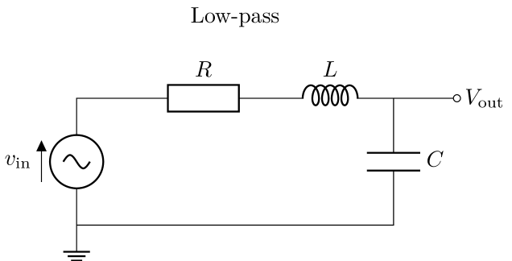
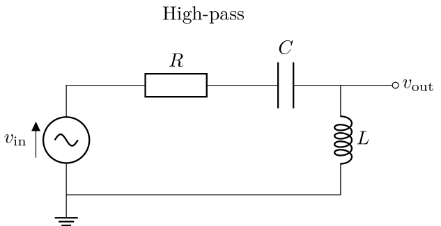
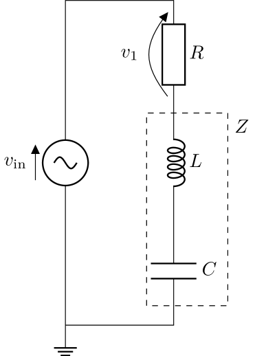
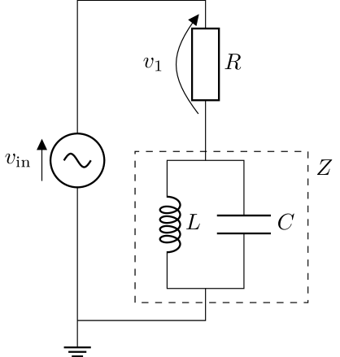
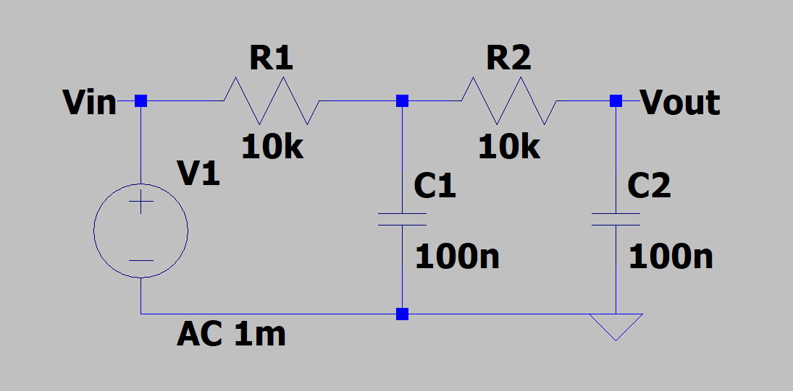
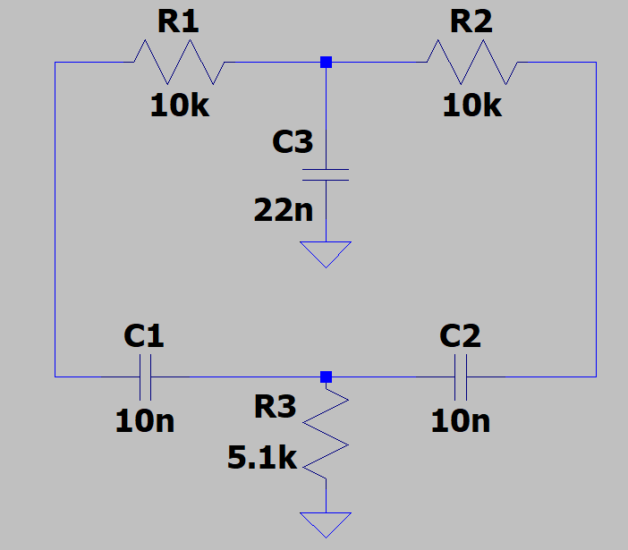
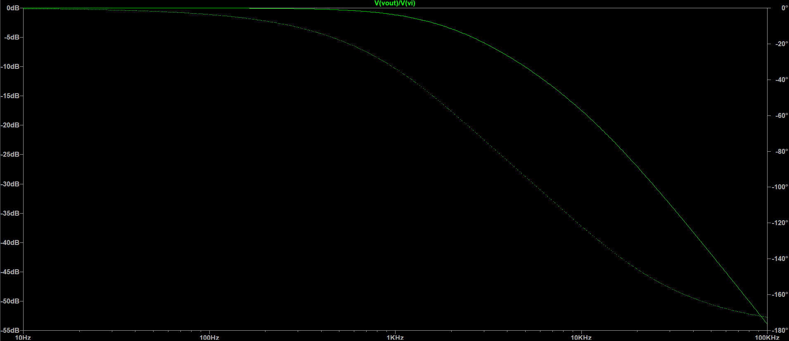

# Analysis and Design of Circuits Lab
# Part 1: Autumn Term weeks 4--6

## Section 3: Resonance and Filters

Capacitors and inductors exhibit resonance when they are connected together — at a certain frequency their impedances are equal and opposite resulting in an overall impedance that is (theoretically) either zero or infinity.
In practice, impedance never reaches zero or infinity due to parasitic resistance.
In this section you will measure the impedance of resonant networks and make filter circuits that use complex impedance to block certain frequencies.

## Before the lab
A resistor, capacitor and inductor can be combined to make a *second-order RLC filter*, meaning that the transfer function $T(f)=V_\text{out}(f)/V_\text{in}$ has a relationship $T\propto f^2$ or $T\propto 1/f^2$ for low or high frequencies.

Use your lecture notes to revise how a second-order RLC filter behaves and how the value of $R$ sets its damping.
Choosing $R$ so that the circuit is critically damped ( $\zeta=1$ ) gives the smoothest response, with no resonant peak.
The components available for this section are listed below; you will use them for the filters you measure and for the design challenge at the end.

Use LT SPICE to produce the magnitude and phase responses of an example second-order RLC filter (do this after LT SPICE has been introduced in problem classes)

**Resistors ( $\times10^0\Omega$ to $\times10^6\Omega$ )**

|    |    |    |    |
| -- | -- | -- | -- |
| 1.0 | 1.1 | 1.2 | 1.3 |
| 1.5 | 1.6 | 1.8 | 2.0 |
| 2.2 | 2.4 | 2.7 | 3.0 |
| 3.3 | 3.6 | 3.9 | 4.3 |
| 4.7 | 5.1 | 5.6 | 6.2 |
| 6.8 | 7.5 | 8.2 | 9.1 |

**Capacitors (multilayer ceramic)**

|    |    |    |    |
| -- | -- | -- | -- |
| 1nF | 2.2nF | 4.7nF | 10nF |
| 22nF | 33nF | 47nF | 68nF |
| 100nF | 220nF | 470nF | 1μF |

**Inductors**

|    |    |    |
| -- | -- | -- |
| 1mH | 2.2mH | 3.3mH |
| 4.7mH | 10mH | 22mH |
| 33mH | 47mH | 100mH |

## Resonant networks

### Series LC network

Use the same method as Section 1 and 2 to measure the combined impedance of a 100nF capacitor and 100mH inductor in series.
The series combination of the inductor and capacitor forms $Z$, the impedance to be tested.

Resonance occurs at the frequency, $\omega_0$, when the magnitudes of the reactances of the capacitor and inductor are equal, i.e. $\omega_0 L = \frac{1}{\omega_0 C} $. Rearranging gives $\omega_0=\sqrt{\frac{1}{LC}}$

For an ideal capacitor and ideal inductor in series, $Z(\omega)=Z_L(\omega)+Z_C(\omega)=j\omega L+\frac{1}{j\omega C}$

At resonance, $Z(\omega) = j\omega_0 L + \frac{1}{j\omega_0 C} = 0$

Plot your impedance measurements to find $\omega_0$, the frequency where impedance is at a minimum.
You will need to take extra measurements around the resonant frequency to see the characteristic in enough detail, so plot your measurements as you take them to see where you need to try intermediate frequencies.
Compare the results to theory and also try to explain the exact value of $Z(\omega_0)$, which isn't zero as predicted by theory.

- [ ] Plot the impedance of the series LC network as it varies with frequency and compare the measurements to theory.

### Parallel LC network
A parallel LC network also exhibits resonance.

Using the equation for impedances in parallel, $Z(\omega)=\frac{Z_L(\omega)Z_C(\omega)}{Z_L(\omega)+Z_C(\omega)}$

Since $Z_L(\omega_0)=-Z_C(\omega_0)$

$Z(\omega_0)=\frac{Z_L(\omega_0)Z_C(\omega_0)}{0}$, which tends to positive infinity as $\omega \longrightarrow \omega_0$.

Repeat the process of measuring impedance, once again with extra measurements to add detail around $\omega_0$.
Use the same values for $L$ and $C$.
Find the maximum magnitude of the impedance and explain why that is the maximum.

- [ ] Plot the impedance of the parallel LC network as it varies with frequency and compare the measurements to theory. Overlay the plot with your results of the series LC network.

### Band-pass filters

The resonance you have just measured is the basis of a **band-pass filter** — a filter that passes a band of frequencies around a centre frequency $f_0$ and attenuates frequencies both above and below it.
A series LC (or RLC) network has its lowest impedance at resonance, so when it is used as one arm of a potential divider it lets signals near $f_0$ through while blocking those far away; the sharper the resonance, the narrower the pass-band.
Band-pass filters are used wherever a single band must be picked out from many — tuning a radio receiver to one station, or isolating a frequency of interest from a noisy instrumentation signal.
This is the complement of the notch (band-stop) response, which rejects a band of frequencies instead of passing it.

## Second-order filters

A second-order filter contains two reactive elements, so it rolls off twice as steeply as a first-order filter (up to $\pm40$dB/decade) and its phase can swing through a full $180°$.
Two second-order filters are provided below; you will measure the transfer function of each.

### Second-order low-pass

This is a two-stage RC ladder: the input drives $R_1$ into $C_1$, and that node drives $R_2$ into $C_2$, with the output taken across $C_2$.
Each RC stage is a first-order low-pass, and cascading two of them makes a **second-order low-pass**: at low frequency both capacitors are effectively open so the output follows the input (0 dB), and as the frequency rises each stage attenuates the signal, so the magnitude eventually falls at $-40$dB/decade while the phase tends towards $-180°$.
With $R_1=R_2=10\text{k}\Omega$ and $C_1=C_2=100\text{nF}$ the roll-off begins near $f\approx1/(2\pi RC)\approx160\text{Hz}$.

### Second-order band-stop (notch)

This is a **Twin-T notch filter**, made of two "T" networks in parallel: an upper T of two resistors ($R_1$, $R_2$) with a capacitor ($C_3$) to ground, and a lower T of two capacitors ($C_1$, $C_2$) with a resistor ($R_3$) to ground.
Away from a single *notch frequency* $f_0$ the signal passes at close to 0 dB, but at $f_0$ the two paths arrive equal and opposite and cancel, so the magnitude drops sharply into a deep null while the phase swings rapidly.
With $R_1=R_2=10\text{k}\Omega$, $C_1=C_2=10\text{nF}$ and the balancing components $C_3=22\text{nF}$ ( $\approx2C$ ) and $R_3=5.1\text{k}\Omega$ ( $\approx R/2$ ), the notch sits at $f_0=1/(2\pi R_1 C_1)\approx1.6\text{kHz}$.

### Measuring the transfer function

Measure the transfer function $T(f)=V_\text{out}/V_\text{in}$ of each filter as a Bode plot — its magnitude and phase against frequency:

1. Drive $V_\text{in}$ with the signal generator set to a sine of fixed amplitude, and connect $V_\text{in}$ to oscilloscope CHA and $V_\text{out}$ to CHB, both referenced to the common ground.
2. Sweep the frequency in logarithmically-spaced steps (about 5–10 points per decade) from 1Hz to 100kHz.
3. At each frequency record the amplitudes of $V_\text{in}$ and $V_\text{out}$, compute $|T|=|V_\text{out}|/|V_\text{in}|$ and convert it to decibels with $20\log_{10}|T|$.
4. Read the phase from the time shift $\Delta t$ between the zero-crossings of $V_\text{in}$ and $V_\text{out}$, using $\arg(T)=360\,f\,\Delta t$ (an output that lags the input is a negative phase).
5. Around any rapidly-changing feature — the roll-off of the low-pass, and especially the null of the notch — take extra, closely-spaced points, and plot each point as you go so you can see where more detail is needed.
6. Plot $|T|$ in dB and $\arg(T)$ in degrees, both against frequency on a logarithmic axis.

- [ ] Measure and plot the Bode plot (magnitude and phase) of the second-order low-pass filter.

- [ ] Measure and plot the Bode plot of the Twin-T notch filter, taking extra points around the notch to capture its depth and centre frequency.

## Challenge: design a filter to match a target response

Design and build a filter whose frequency response matches the Bode plot below as closely as you can. The plot shows the magnitude and the phase of $T(f)=V_\text{out}/V_\text{in}$ against frequency.

- [ ] Study the target plot and work out what kind of filter produces it. Read off the pass-band gain, how steeply the magnitude rolls off, the total change in phase from low to high frequency, and the corner frequency — and use these to decide what circuit you need and how many reactive elements it must contain.
- [ ] Choose component values from the parts list so that your design's predicted magnitude and phase match the target, and verify the design in LT SPICE.
- [ ] Build the filter, measure its magnitude and phase response between 1Hz and 100kHz, and plot your measurements against the target. Explain any differences.
